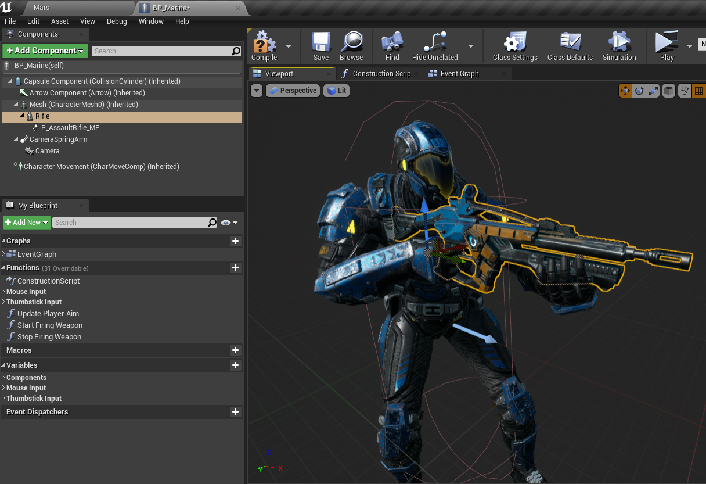
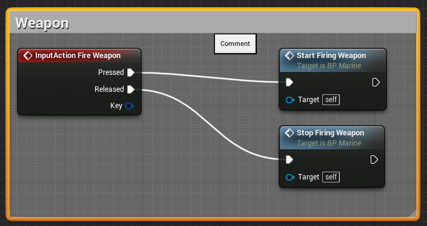
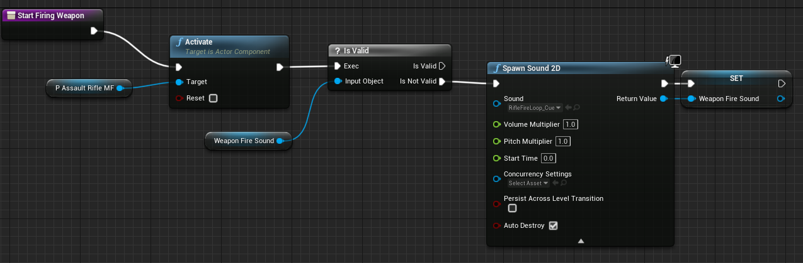
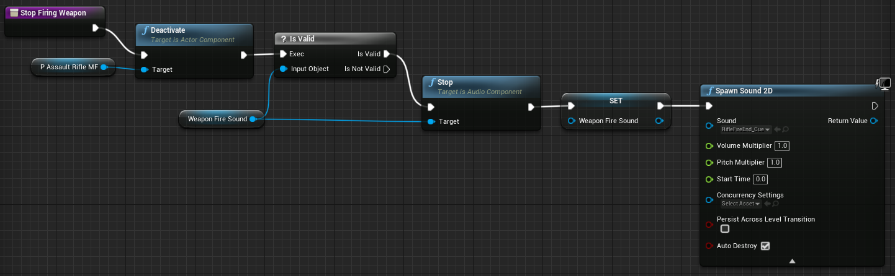
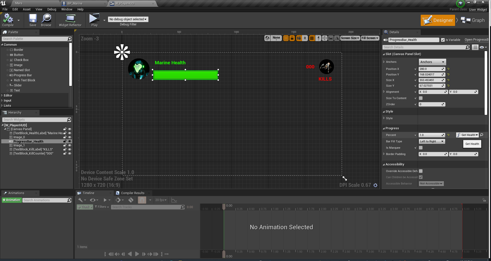
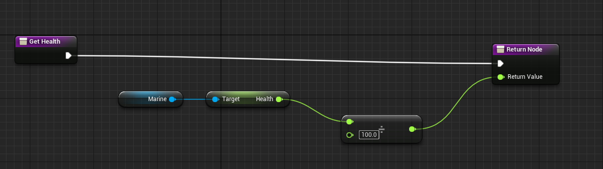

# UE4_MarsMarine
Content from course - https://www.udemy.com/share/101Xs6AEoacllQRnQ=/

## Change Log

* Added `Content\Blueprints\Pawns\BP_Marine.uasset` BP Class (Character Pawn)

* Added `Content\Blueprints\GameMode\BP_MarsMarine_GameMode.uasset` Game Mode

* Added `Content\Characters\Marine\Materials\M_Marine_Inst.uasset` material instance

* Added SpringArm and Camera components to `Content\Characters\Marine\Marine.uasset`

* Added WASD movement

* Added `Content\Characters\Marine\Animations\AnimBP_Marine.uasset` AnimationBlueprint

* Added locomotion state machine to switch between IDLE and RUNNING based on character velocity

* Added `Content\Characters\Marine\Animations\Movement_BlendSpace.uasset` Blend Space

* Updated `Content\Characters\Marine\Animations\AnimBP_Marine.uasset` Event Graph

* Updated `Content\Characters\Marine\Animations\AnimBP_Marine.uasset` AnimationBlueprint and replaced the Idle and Running States with the BlendSpace

* Now the marine movement direction input from WASD drives the animation states

* Added mouse aiming

* Added gamepad aiming

* Added gamepad movement

* Added aim smoothing

* Added input switching

* Organized `Content\Blueprints\Pawns\BP_Marine.uasset` character event graph, functions, and vars.

* Added a skeletal mesh component as a child of the `Content\Blueprints\Pawns\BP_Marine.uasset` mesh component and attached to the `WeasponPoint` socket.

* Added a Particle System component as a child of Rifle and attached to the `MuzzleFlashSocket` socket for the barrel flash.

* Added weapon fire functions to the event graph to handle activating the muzzle flash and weapon sounds when the mouse is clicked or game pad trigger is used.

* The `Start Firing Weapon` function activates the particle system and plays a 2d sound.

* The `Stop Firing Weapon` function deactivates the muzzle flash and stops the sound. An end shot sound cue plays to hide the abrupt stopping of the sound.

* Added a BP_Marine Player HUD

* Added bindings for player kills and player health

* Added alien damage and death animation

* Added enemy waves

* Added player respawn

* Added particle impact effects

* Added tracer fire with a Niagra Particle System [video tutorial](https://www.youtube.com/watch?v=KDTVLMEcLjE)
