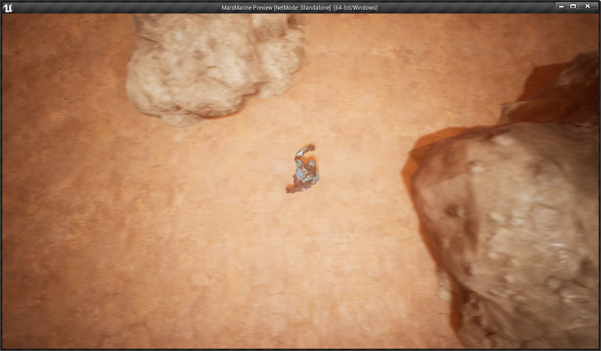
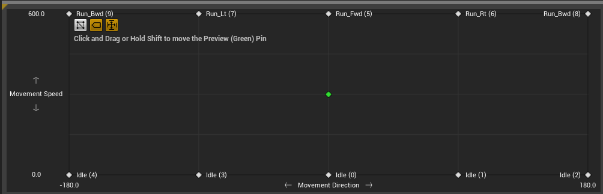
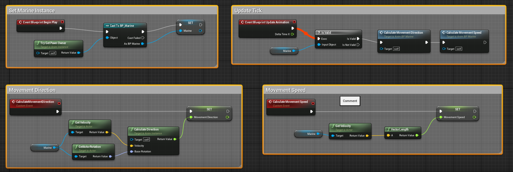
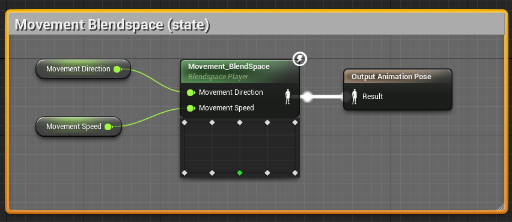
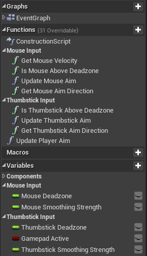

# UE4_MarsMarine
Content from course - https://www.udemy.com/share/101Xs6AEoacllQRnQ=/

## Change Log

* Added `Content\Blueprints\Pawns\BP_Marine.uasset` BP Class (Character Pawn)

* Added `Content\Blueprints\GameMode\BP_MarsMarine_GameMode.uasset` Game Mode

* Added `Content\Characters\Marine\Materials\M_Marine_Inst.uasset` material instance

* Added SpringArm and Camera components to `Content\Characters\Marine\Marine.uasset`

* Added WASD movement

* Added `Content\Characters\Marine\Animations\AnimBP_Marine.uasset` AnimationBlueprint

* Added locomotion state machine to switch between IDLE and RUNNING based on character velocity

* Added `Content\Characters\Marine\Animations\Movement_BlendSpace.uasset` Blend Space

* Updated `Content\Characters\Marine\Animations\AnimBP_Marine.uasset` Event Graph

* Updated `Content\Characters\Marine\Animations\AnimBP_Marine.uasset` AnimationBlueprint and replaced the Idle and Running States with the BlendSpace

* Now the marine movement direction input from WASD drives the animation states

* Added mouse aiming

* Added gamepad aiming

* Added gamepad movement

* Added aim smoothing

* Added input switching

* Organized `Content\Blueprints\Pawns\BP_Marine.uasset` character event graph, functions, and vars.

